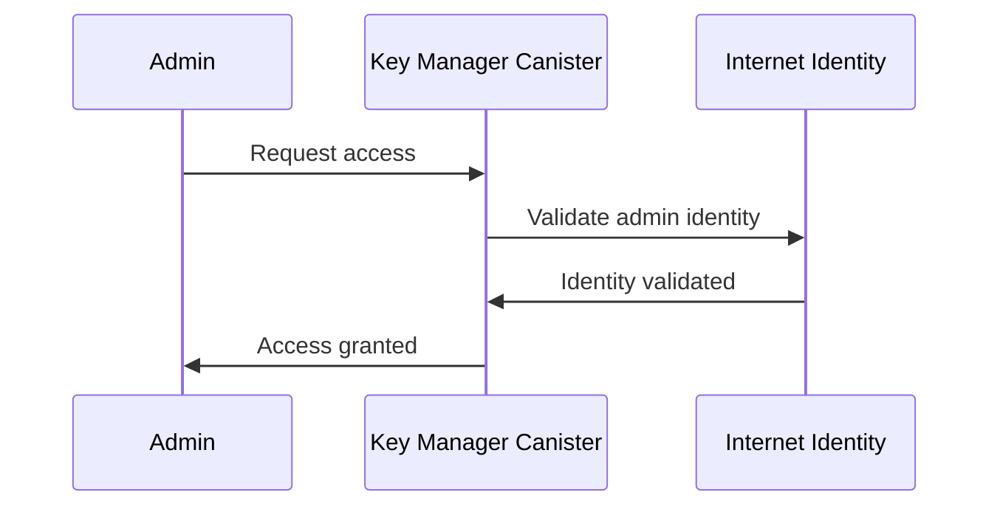
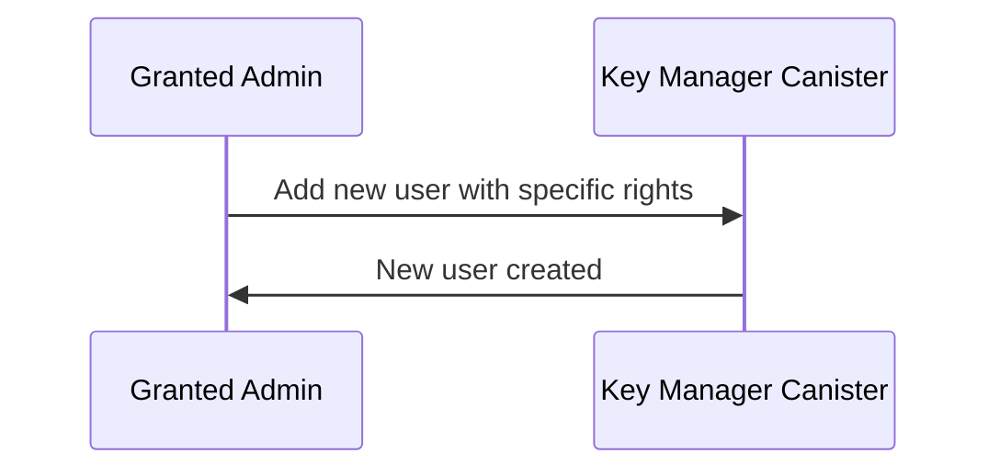
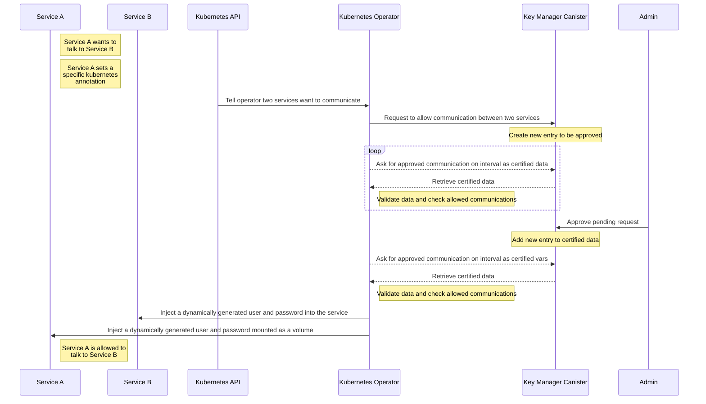

```mermaid
sequenceDiagram
    participant Admin
    participant Key Manager Canister
    participant Internet Identity
    Admin->>Key Manager Canister: Request access
    Key Manager Canister->>Internet Identity: Validate admin identity
    Internet Identity->>Key Manager Canister: Identity validated
    Key Manager Canister->>Admin: Access granted
```

```mermaid
sequenceDiagram
    participant Granted Admin
    participant Key Manager Canister
    Granted Admin->>Key Manager Canister: Add new user with specific rights
    Key Manager Canister->>Granted Admin: New user created
```

```mermaid
sequenceDiagram
    participant Service A
    participant Service B
    participant Kubernetes API
    participant Kubernetes Operator
    participant Key Manager Canister
    participant Admin
    Note right of Service A: Service A wants to <br> talk to Service B
    Note right of Service A: Service A sets a<br>specific kubernetes <br>annotation
    Kubernetes API->>Kubernetes Operator: Tell operator two services want to communicate
    Kubernetes Operator->>Key Manager Canister: Request to allow communication between two services
    Note over Key Manager Canister: Create new entry to be approved

    loop
        Kubernetes Operator-->>Key Manager Canister: Ask for approved communication on interval as certified data
        Key Manager Canister-->>Kubernetes Operator: Retrieve certified data
        Note right of Kubernetes Operator: Validate data and check allowed communications
    end

    Admin->>Key Manager Canister: Approve pending request
    Note over Key Manager Canister: Add new entry to certified data
    Kubernetes Operator-->>Key Manager Canister: Ask for approved communication on interval as certified vars
    Key Manager Canister-->>Kubernetes Operator: Retrieve certified data
    Note right of Kubernetes Operator: Validate data and check allowed communications

    Kubernetes Operator->>Service B: Inject a dynamically generated user and password into the service
    Kubernetes Operator->>Service A: Inject a dynamically generated user and password mounted as a volume
    Note right of Service A: Service A is allowed to <br> talk to Service B
```
