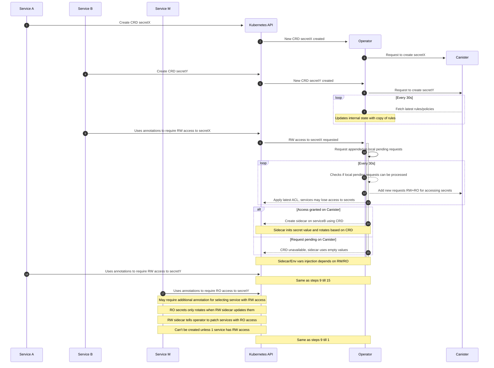

# High level design

## Components

- Services
  - Creates secrets (CRD)
  - Requests access to secrets as RO/RW
- K8 Operator
  - Interacts with the canister to get latest policies in form of ACL
  - Adds sidecar to services with permission to use RW secrets. RW here means the sidecar will rotate the secret.
  - In cases where services use RO access to secret, the service will depend on at least 1 service with RW access to the same secret.
  - Listens for RW service to update secret which will then be propogated to RO services that are dependencies.
- ICP Canister
  - Manages ACL, includes permission to create secrets and access them through services.

### Sequence Diagram

[✏ edit](https://mermaid.live/edit#pako:eNqdVttuIjkQ_ZVSS6N5mE7CJeH2MBIwibRi2UagUTYrXpzuytA7xu613WTYKP--VW03ASZkouUB0ebU8alTVW4_RanOMBpEFv8pUaX4JRffjFgvFdBHlE6rcn2Pxj-nBoVDKIRxeZoXQjlYDEFYWKDZ5CnC8DRutI8bncZN93HTk7hJj3GTkrQpdGhhOPvNgz98eA0_vmH8WKjcOjRwY7RyqDIfshieff78adIbwNhHjudfwCLRuD_hpIRkxpRJgUY4HRya9JgpmQ3gD3w8oPEE2Um28WhfoIclM2IbjwYw5-pYB07XoYE26B-d1H_3tq67Q12_3DDQSa0LuN6g2UK7Yf1aiD-r4m_QpSuQFEgkppRoLwotKVfcQytNvJpYgIV9LTKGQ06FMUpIsI73fczdClJdbEE_eKal8hS78lHF96liFjBMU7QWTMjjQRvCqDP8QfaGXGzMYSCk1I-YnUPNW7nJZn61JEcoAgmXa2XZDSbMDcL8FoTfghYPilFZzQm9BqkFYRb6SqQu33CeyazevypCRRDEi6KgXCmEeKROyRp-ztW3ms2-oyoV43iF6Xey-OEED6RCwT01ptEsvG6LF5LK2iwDRV20C5rffponlcU-X2YMFh_Hs63DopDbujeG499jAlfjbmEt6A9t8Sfj7FHJ97-FdHW56ehS7K1WR5N0qCBMic0zTIVhdFAwgrJSTwPyWptOejG7uAhxucopey8QNkKWpFtlYLhfKJl7YYOUmg0lpVZXtfb-V1ppVkslNiKX4l5ivFNdcnfiunBbv_exRQcjwUxB9sW12lCE4Un7G1PubMiQ1VjWMr-9mCeeIcNXurM6K__HdNwdq6rNFGvkk4_yLyz0weVSQvOKtwsbTt-zYfKuDRfTAUypx-owkWU5c9EovBBXnWxRsjdVJ_t3UXUQ7RI7QU46QsOSl9TldS88rpCtfSleOOzcCtenqF7QDqUkwvCm4RQLwefrbm68tuRtbdRlHx1Pdzjyqa0kO9bcpbgS9s0M36wXo6M4WqNZizyjK8UTry0jThGX0YB-ZsJ8X0ZL9Uw4vlsstiqNBs6UGEfekXD9qBfpzfiX1vuP0eAp-hENzppXjfNOp9lqNxuXvVa332_F0ZbWL7vnl53OZbPRb3d79Gk-x9G_FUXzvN_tNPqd5lW7ddVvdbvtOEIqvzZTfwWqbkK1kOvqH7_x83-2x_or)
