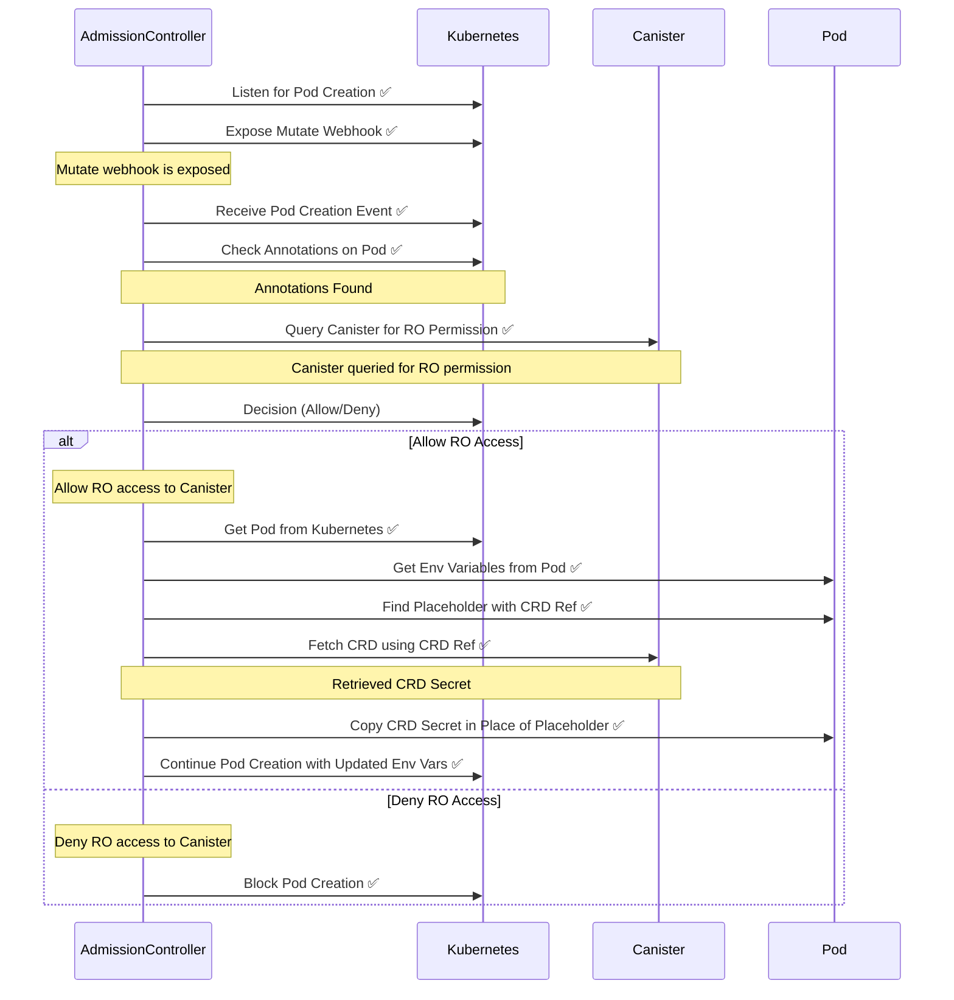

# Admission controller RO Request

[✏️ Edit here](https://mermaid.live/edit#pako:eNqlld-S0jAUxl8lkyudqSsFaqEXO4MFvNAdkR11xulNSA9LhjapaQrLMlz6Fj6dT-JpSvmzi1oVbiDJ98s5OV9OtpSrGGhAc_hagOQwFOxOszSSBD8Z00ZwkTFpyCBORZ4LJUMljVZJAvrporfFDLQEA_nTuZBJkZtLqomKI1kNX9jlxfX1ERuQdyVEkrnSpY6EGpjB9eTH929NEaP7TOVAbgrDDJDPMFsotTwCpMJRtQJ9CRXUsvVeJnIClhc33X4KHMQKzsMfrQBP4i-SCBfAl2QgMVpLyAlSSmSzPBxyCjvFjFUhf5tLXciAfChAbw6FtTWZvicT0HtZ41iOyAMM7agFxDU0O0CbHtAQuLBBPBskiVq_HILcPK99xhJ0dDlcsgecQ753bAMDHHTM6ohRj7zdLL43YJ1P5lqlJ8U4ntmvMSir9CO5Ip-YFmyWoNKSzizwB8RYyJhMEsZhoZIY810LsyDhdIgenTehHOs2BsMraZELeXcZ0tgFUzBY_BWWv-TcAtdgGmUUqmxzoiFCVvkRNT9LtEFuZ5cNJ4QsHt1Ze1ofsxjbQVyX4qR-kGCTKV33Dx6rZf9nsdeJwh5xuU2CtE23-lKHpnjBmIjxKdiWCyJqFpBCRAP8GTO9jGgkd7iOFUbdbiSngdEFOLSw-e-fDRrMGWbtUOzrX5RK60X4lwZbek8Dt9u_6ve7nu-5vXbP9z3PoRscdq9cv9v22y2_22v5Xqezc-iDJbSueq7Xbnmu96rX6rgd13UoxMIofVM9XfYFqwMZ2Zlq391PUr9kBw)
