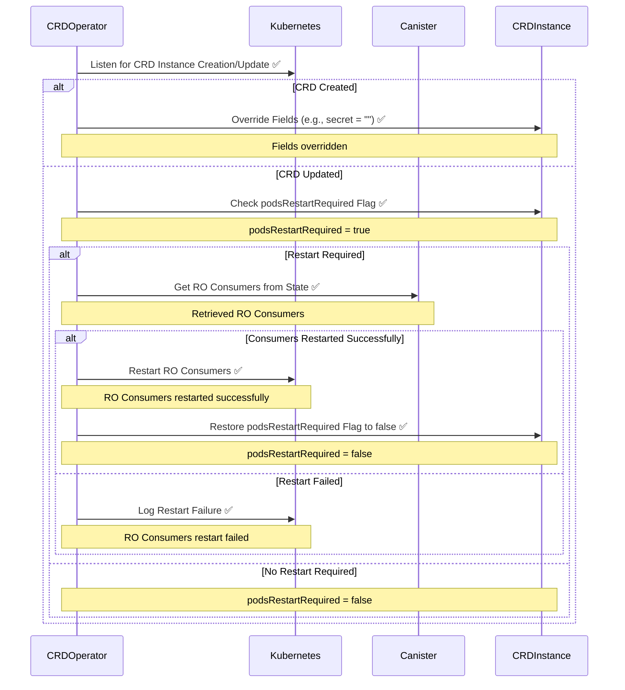

# CRD Operator

[✏️ Edit here](https://mermaid.live/edit#pako:eNqtlc1u2zAMx1-F0GkD3CxOnQ8baC_pMgz7CJBgl8EXzWJSobaUUXKxLOixb7Gn25NMtmPXXtKmBZqTI5J__ijS9I4lWiCLmMGfOaoEryRfE89iBe634WRlIjdcWZguruYbJG41HRo_5T-QFFo0RwK5ksYiHZX8qIzlLm2sKnMry9nl5YNsBJ8LEQUrTYUT1IEwJeRWavXu20Zwi_D3z30txtMyR-WCojo8zNLCiGB-i0RSIMwkpsLAG-ytex4YTAgtXEDMYva2SlKrKe3SahfX1vWgI7tX05W6QFUzYmqwhKzwnwc5vcbkBjZamAW6M7IL1z1JKGCW8vXL6Y4pXYClvOlLfZ17L6jdHqxHkPeNj-CDu7rFHKZamTxDMrAincHSNv1qizwG3Kgt0JLEW8fY1myTNs1vEu65XcwyTxI0ZpWn6bYb8fT8NZW36ziAf6KAjlhbhBo202E7RddpYYGnCR8fCqthxYthewnzM6akFO0KljNd39eMy_T_OTnxput1JzonfNWLdsiHSKhaB2UBX_WJaX-1O2tyuwfmMceacSncUt4VxzGz15hhzCL3KDjduBWk7pwfz61eblXCouJN9VhebpD9AmdRmcRjbtN-1zqrndxfFu3YLxYNwt4o9AfhcByOhoPJaDL02JZFZ8G4N_BH_Uk48QP_POgP7zz2u1To98Jg4AfOch6MJ8Ng5HsMhXRVf6k-IuW3pAZ5X1qqvHf_AMmOEn4)
