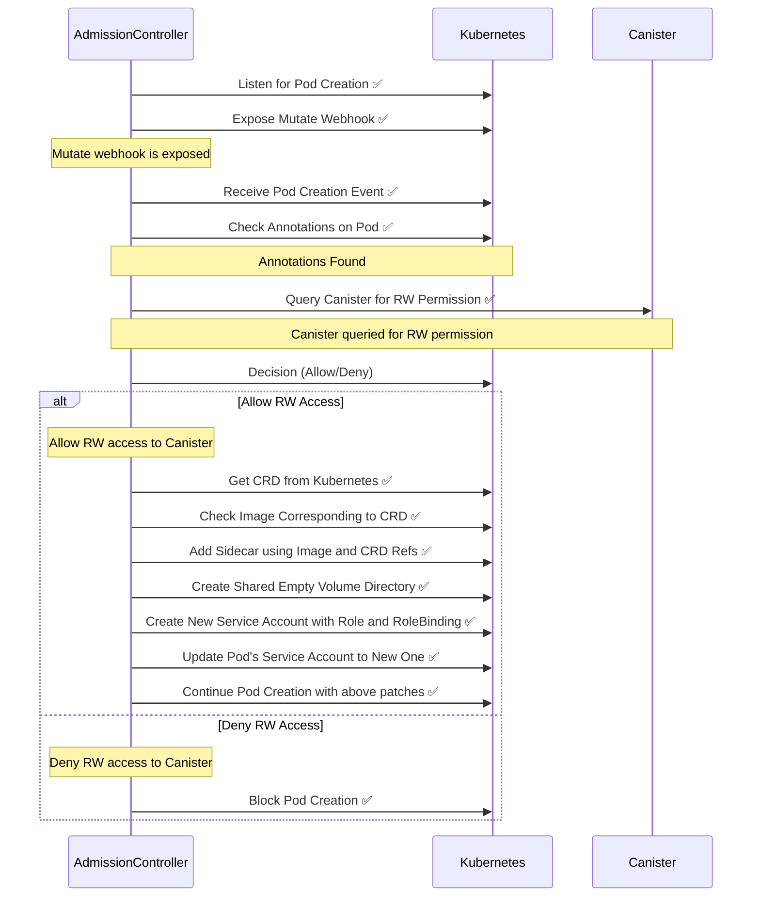

[✏️ Edit here](https://mermaid.live/edit#pako:eNqdldFu2jAUhl_lyDfbpIxBYRByUYkCm6atWwfaKk3cGPtQrCZ25jhQVvVyb7Gn25PsOBCgA22h5CbEPt_5fc5v-54JI5FFLMPvOWqBA8VvLE8mGuiXcuuUUCnXDnoyUVmmjO4b7ayJY7SHk97nU7QaHWaHY32uVeZ8lH_86BHky_PzHSOCDz5Cw8xYuDIS-ha5o_nw-9fPqojhXWoyhMvccYdwjdO5Mbc7gDb01SzQHkNFZdhyE6YywIInq6YfoUC1wMfyhwukgpywiP4cxS30NKktCBkQxSOrrSOAfdg-5o3J9T_XUnYtgs852tW2i0VPRtdwhXYTVlnLDrmFkfesQllC0y20aoEGKFQh4nkvjs3y1QD16kXpMx6Tff1nz-4JgdnGnhUMsI3jRRw488jIJeX_Ct8ibYHRAGbWJHvt2FXtFCe8S_gNQt9Yi1lqtFT6plBG_BN5PSlhrCQKbiHPPGfN5loWuBHOTtfofY4wnnNLPR0mqVvBVxPnCcJAWRTOkJGexvyISxijXSiBvpPkXgdL5eYwMvFatH-5UOuSnJjjSyp9DtpXz7KDLFRen_yTxpOl04DS-V9nQKGaT8l5dEo6Md-3AsZ0YnkLP8GwZdgxv1bXfBEbstnxMxe1ZAFLaI9yJenquPefJ8zNMcEJi-hVcns7YRP9QPN47sx4pQWLnM0xYHlR5M01w6IZp7UGjG6Ib8Yk5ST6y6J7dseiblhrdZuvG2Gz3mx1wlbAVizqhLV2o9vstutnHXoa7YeA_SjC67WwHbYa3VY97HTDs0YnDBhKRY67XN9zxXVXqhgWI-ukD38AuyV4pQ)
