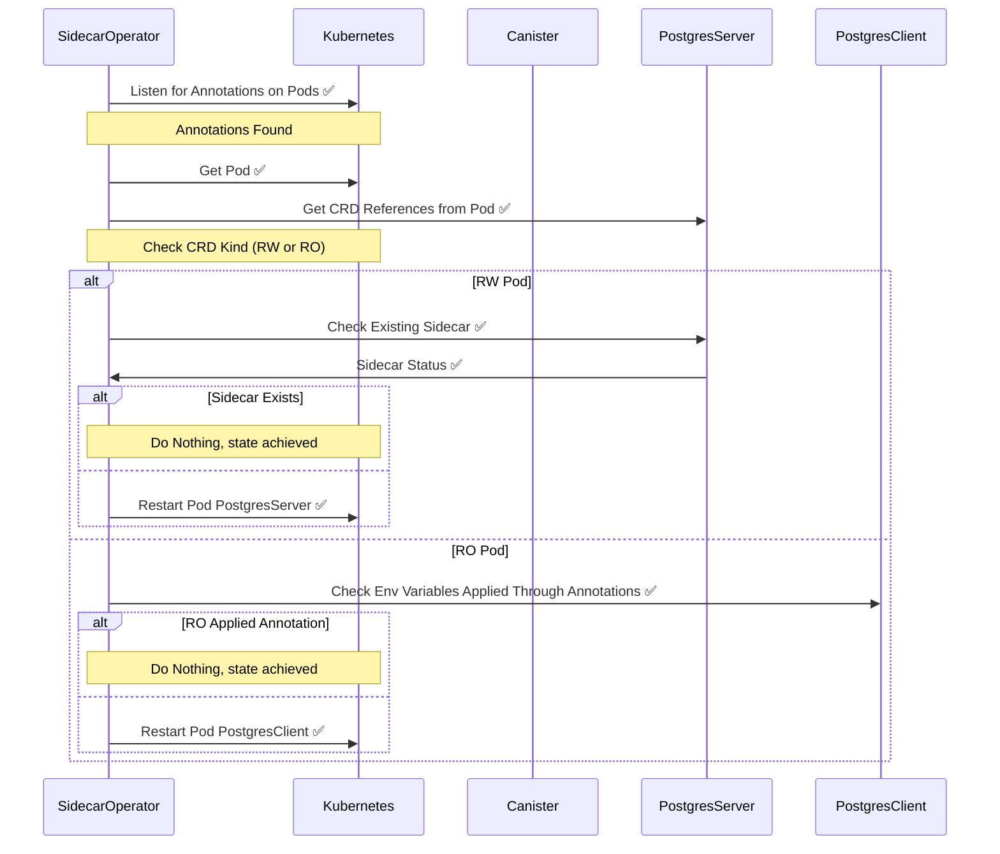

[✏️ Edit here](https://mermaid.live/edit#pako:eNrNVMGO0zAQ_RXLJ5BC1TS0aXNYadUuHBZYlCJWQrl442ljbWMH26l2qXrkL_g6voRxvNk0Lax6xLnYmZn33jxbs6O54kATauB7DTKHhWBrzcpMElwV01bkomLSkqXgkDN9U4FmVunThOv6DrQEC-Y0NmdSGAt_qfqsjF1rMEvQ25fi840AaTPpPpdzJOfNxUXHn5APjk2SldLkUkplmRVKGqIk4nFDfv_66VEwBEQh8TFecIh2CPFO1ZKfI-E9OPG84zpN7_fuS-bpgqSwAu0uw5CVVmUf5jzJ8wLy-wbsWkhOXqW3BL1Ib163_rGNJfgTof35PIUe9uoB7RVy3RZ04tzq1yDIEWzyXLZEU2vTr3a62njDY7rY-e0vFPmkbIEaA2KQBQjLCwFbOOgWNgb62C9faAqIpP2l9nvsdwDt-3AEaPm5HvsX_uyx3JKvTAt2t8FncFlVGOXkS6FVvS56L_LEPqRs87u8_9lF3_m_XHQb_9GAlqBLJjgOrJ0LZ9QWUEJGE9xypu8zmsk95rHaquWjzGlidQ0BrSuO-p-GG01WDGUHFCfMN6XKNgmPNNnRB5qEbwfxLJ6Gk2k8G0ejKA4D-oi_40E8GkbD2Xg2jMfRJJ7sA_qjQQgHw9EojKaYixXhdBJQ4AL7_-jnazNmWx1XTcTT7v8A4JfcLg)