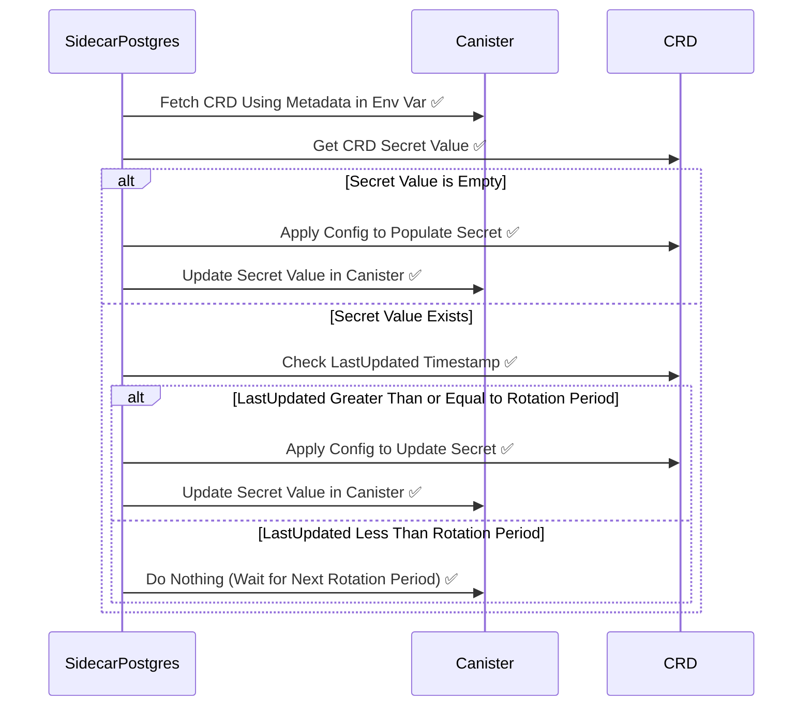

[✏️ Edit here](https://mermaid.live/edit#pako:eNqtVMFu2kAQ_ZXRnlrJRdjgGnyIVAHNJYkQJKlU-TKyB1jF3nV2xxUUcexf5Ov6JV1jIEDSRpHq03rnzZv3nnZ3LVKdkYiFpceKVEpDiXODRaLAfSUalqksUTFMZUYpmrG2PDdkXwIGqKRlMq9UJsNENdtnLJ8uLvZtMXwlThc1GO6sVHO4JsYMGUEqGKkfcI8Gfj_9-ivRZBjDJW3HwZRS45b3mFfUNDVtmPNpTVoYFSWvmvI_mL-UZb6CgVYzOQfWMNZllSPTnu6g7C2bd2V21LZToQ7xPRNRbs9go6WD2DelDhaUPsAVWm5mZXArC7KMRXmcxT6PY-ClIaxF3C5QgTYweqwwr-1ONCNLrWBMRursmeEdkZ06Pwnsv4V2CO7Y1RVZ21h6r42DgKGGG82L-lx--IaSYebSuaEln1N-PNOidkPcQniiIFOgzNyFW9fbieAFFZSI2C0zNA-JSNTG4bBiPV2pVMRsKvJEtXWyu5winqGz6Al3u75rXexB7lfEa7EUsd_tt_r9bhiFfi_oRVEYemLltv2WH3WDKGhH3V47CjudjSd-bhnarZ4fBu3QDz_32h2_4weeoEyyNtfNA7F9J_ZCRttKM3fzB-yMamY)
